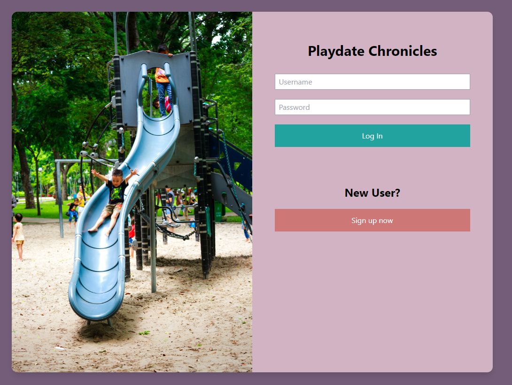
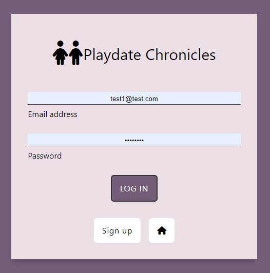
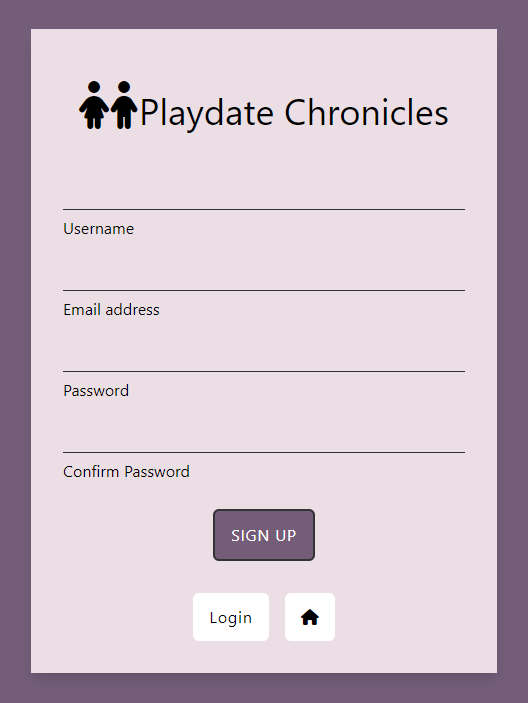
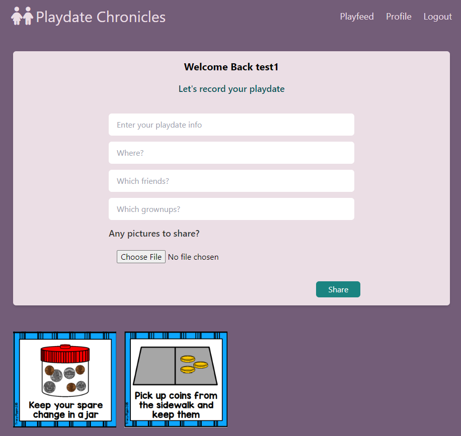
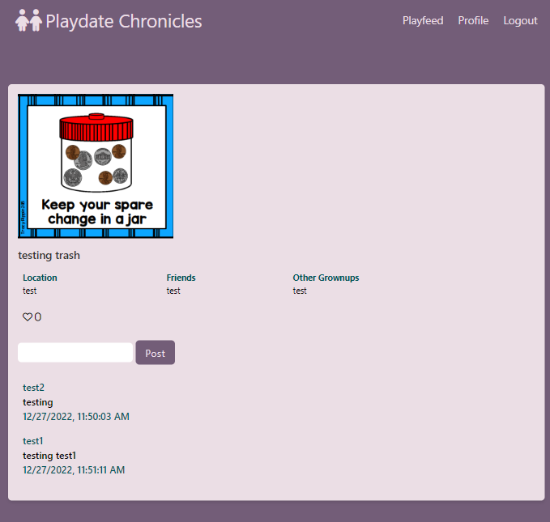

# Playdate Chronicles

You ever have a hard time remembering who your children had playdates with? Who those kids grownups are?
This web application is for YOU!. This application allows the user to store all their children's playdate
information so they can keep track of them and remember them. Users can create and delete playdates as well as view 
other people's playdates.

[View Live Site](https://playdatechronicles.cyclic.app/)

## About The Project
This is a Full-Stack CRUD application using Node.js, Express, MongoDB, and EJS.

## Site Screenshots
#### Home Screen

#### Login Screen

#### Register Screen

#### Profile Screen

#### Post Screen

#### Playfeed Screen

## Demo Video
.gif)

## DEMO
If you would like to demo the application, you can use the following:

-- email: test1@test.com

-- password: 12345678

*You can add anything you like. Please delete only your items. Thank you!

## Technical Requirements
- Working full-stack application, built using Node.js, Mongoose, Express and EJS
- Adhere to the Model-View-Controller (MVC) file structure
- RESTful routes and full CRUD abilities
- Deploy online and accessible to the public via Cyclic

## Technologies Used
#### Frontend
- Javascript
- HTML
- Tailwind CSS 
- EJS
- Node.js

#### Backend
- Express
- Mongoose
- Passport

#### Deployment
- Cyclic
- MongoDB

### Optimizations
- Allow user to log in with Google
- Allow users to keep some playdates private
- Allow users to search/filter playdates by location, friends, and grownups
- Add about page
- Add validation to date
- Allow user to update their profile and add profile and cover photo

